Final Project
==============================

| **Name**  | Yosuke Katada  |
|----------:|:-------------|
| **Email** | ykatada@dons.usfca.edu |

## Instruction ##
Before you start shiny app, please make sure that you install the following packages:
- `ggplot2`
- `reshape2` 
- `reshape` 
- `scales` 
- `grid` 
- `plyr` 
- `RColorBrewer` 

After that, use the following code to run this `shiny` app:

```
library(ggplot2)
library(reshape2)
library(reshape)
library(scales)
library(grid)
library(plyr)
library(RColorBrewer)
library(shiny)
runGitHub("msan622", "yosukekatada", subdir = "final-project")
```

## Discussion ##

### Dataset ###
The dataset is about the customers' response to a direct marketing campaigns for getting term deposit customers at a Portuguese banking institution. The data has 45211 rows and 17 variables. Each row represents each customer. The independent variables are demographic, transaction-based and historical marketing reactions. A dependent variable is "has the client subscribed a term deposit?", which is binary response. 

Also, I changed the order of factor levels about the binary response, ("No", "Yes) , regarding whether a customer accepted the campagin for visualization. Originally, the order of the levels was "No" and "Yes". However, the audiences seem to be interested in how many or much percentage of customers accepted the campagin. So, I changed the order of the factor levels from ("No", "Yes") to ("Yes", "No").

The following is the first 10 data points.

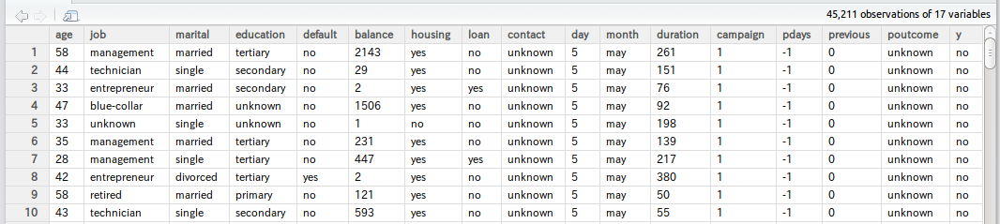

[Data Source is here.] (http://archive.ics.uci.edu/ml/datasets/Bank+Marketing)

#### Introduction ####
I suppose that this shiny app tries to help a marketing analytics personel to analyze the data, get the inights, and finally evaluate ROI of the marketing campaign. This application consists of four components: Univariate plots, Multivariate plots, Modeling, and ROI simulation. 

The following is a summary about how each component associates with techniques and interactivity.

| **Component**  | **Techniques**  | **Interactivity**  |
|:---------------|:----------------|:--------------------|
| Basic Profiling (Univariate plots) | Density plot / Box plot / Bar chart / Stacked Bar chart (Normalized) | Switch to small multiple |
| Multivariate Plots | Heat Map / Scatte Plot | Zooming |
| Modeling | Bar Chart | Sorting |
| ROI Simulation | Line Chart / Bar Chart | None |


### Techniques ###

#### Basic Profiling (Univariate plots) ####

##### Density plot and Box plot #####
In the dataset, there are seven numeric variables such as `age`,`balance`, and so on. For them, I created density plot and box plot. Among them, `duration`, which means last contact duration (I guess how many seconds a customer talked with the bank personel at the most recent call), has distinct distributions between the customer who opend term deposit and the customer who did not.  

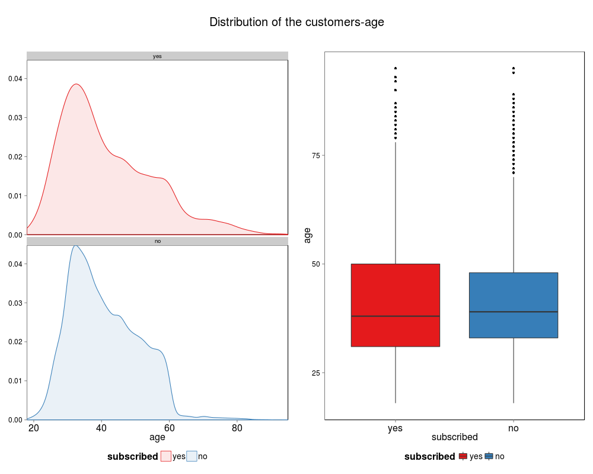

- Lie Factor: Almost one
- Data Ink Ratio: High enough for easily understanding
- Data Density: It is possible that the two distributions are almost same shape. Therefore, to avoid data density problem, I used small multiple.


##### Bar chart and Stacked Bar chart#####
There are lots of categorical variables such as `job`,`married`, and so on. For categorical variables, bar chart is one of the easiest way to demonstrate how many customers or how much percentage of customers accepted the campaign. For example, the following is the bar chart and the normalized stacked area bar chart about `job`. By looking at the normal bar chart, I can know which jobs are dominant in the data. Also, when I looked at normalized stacked bar chart, student and retired customer can accept the campagin more likey than other jobs.

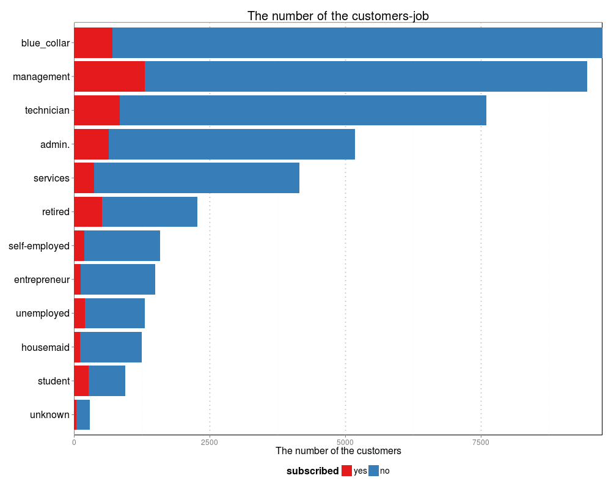
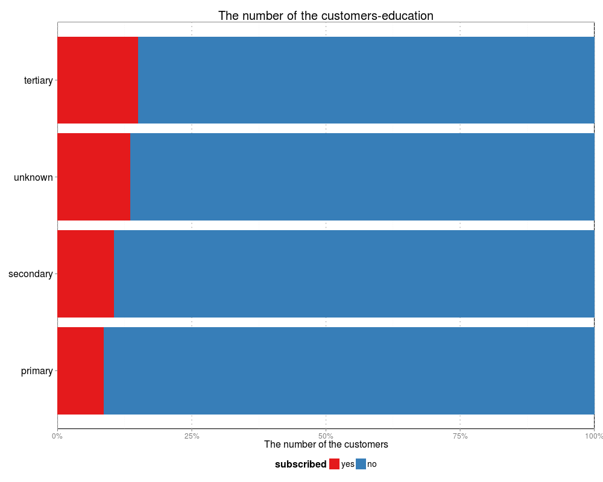

- Lie Factor: The x axis is  fixed from 0 to the highest. So, Lie factor should be one.
- Data Ink Ratio: High enough because I deleted minor grids and customized major grid.
- Data Density: I flipped x and y axis for the audiences to read the labels more easily. Therefore, data density is fair. 

#### Multivariate Plots ####
##### Heat Map #####
Although I found out some interesting variables which seem to predict customer reactions, I needed deeper analysis. So, at this time, multivariate plots were useful. First of all, heat map helped me to examine the interactions between two variables. For example, when I used `duration` as x axis and `job` as y axis for heat map, I found out some buckets which have higher pecentage of the customer who accepted the campagin (Red buckets).

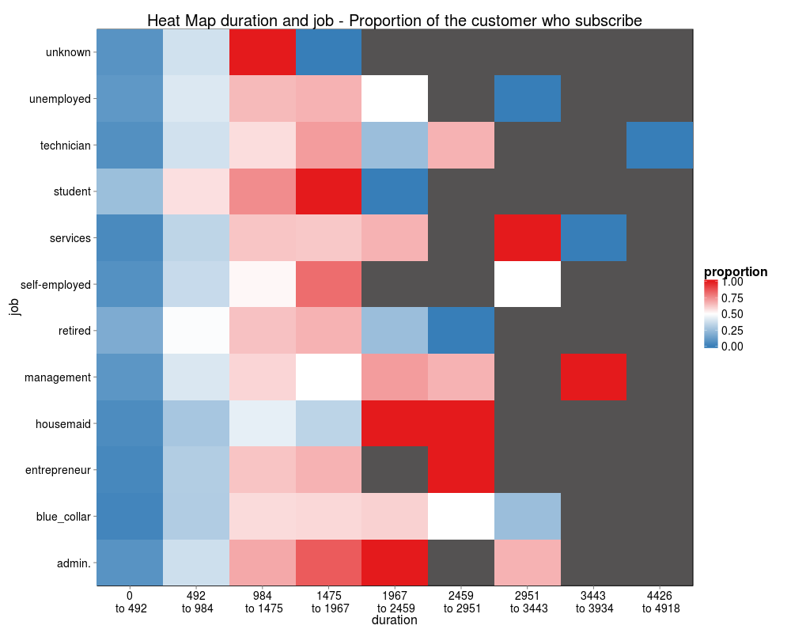

- Lie Factor: To avoid exaggeration, I used equal interval method instead equal frequency metohd for discretization. So, I believe that there is no lie factor.
- Data Ink Ratio: High enough
- Data Density: Although some one plots the numbers on the heat map, I did not do so because I wanted to avoid data density problem. 


##### Scatter Plot #####
Heat map can compare any two variables if I discretized numeric variables. However, I am interested in more raw data only for numeric variables. So, I created a scatter plot. 

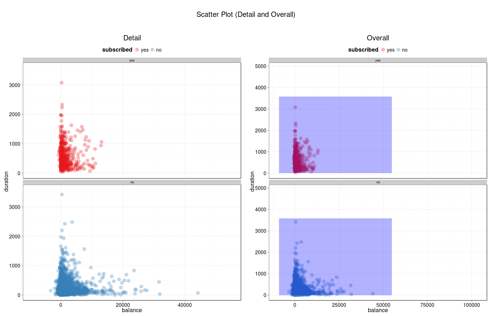

- Lie Factor: Almost one because I did not emphasize any elements.
- Data Ink Ratio: High enough
- Data Density: Data density may be a litte bit problem since the data points are more than 40,000 in the data. So, in order to ease too dense points, I did random sampling, employed facet_wrap function, and specified smaller alpha for points.

#### Modeling ####
##### Bar Chart #####
For predicting the customers' response, I developed logistic regression model. In order to evaluate which variables have impact on the oredictions, I created a bar chart of the standardized coefficients. The variables are sorted by decreasing order of coefficients. According to the bar chart,  As `duration` increases, the likelihood that the customer accepts the campagin significantly goes up. On the other hand, if the contact is unknown, the likelihood decreases most significantly. 


- Lie Factor: Almost one because I did not emphasize any elements.
- Data Ink Ratio: High enough
- Data Density: Labels is the most important things for the audience. So, I fliped x and y axis (if I used labels in x axis, some labels are overlapped each other). I think that data density does not have issues. 


#### ROI Simulation ####
##### Multiple Line Plot #####
So far, I analyzed the data to investigate which variables are influencial to determine which customer more likely accepts the marketing campagin. However, more importantly, I need to think about ROI when I plan the similar campagin. So, the final part is ROI simulation. Based on the prediction model, I simulated ROI, assuming that the bank executes the similar marketing campagin. I used the simplest plots like a multi-line chart and a bar chart because the target audience would be non-experts. 

The multiple line chart represents simulated revenue and cost along time series. Also, the bar chart at the bottom left is profit (= Revenue-Cost at the previous line chart). The third plot at the bottom right help me to compare the generated cash from a marketing campagin and the cost associated with execution of a campagin.


- Lie Factor: Almost one
- Data Ink Ratio: High enough since I deleted unnecessary grids.
- Data Density: I beleive that there is no issues on data density.


### Interactivity ###
#### Basic Profiling (Univariate plots) ####
In "Basic Profiling" page, you can select any variable. Shiny app automatically show you a bar chart or a density plot with box plots based on whether the selected variable is numeric or categorical. When you select a numeric variable, you can use log scale and small multiple for density plot. In case that you choose a categorical variable, you can switch between a simple bar chart and normalized stacked bar chart. Also you can sort the bars by decreasing or increasing order. 


#### Heat Map (Multivariate Plots) ####
Like the previous page, you can choose two variables for constructing heat map. If you choose a numeric variable, you can specify the bin of discretization. This means you can zoom in or zoom out as you like. 
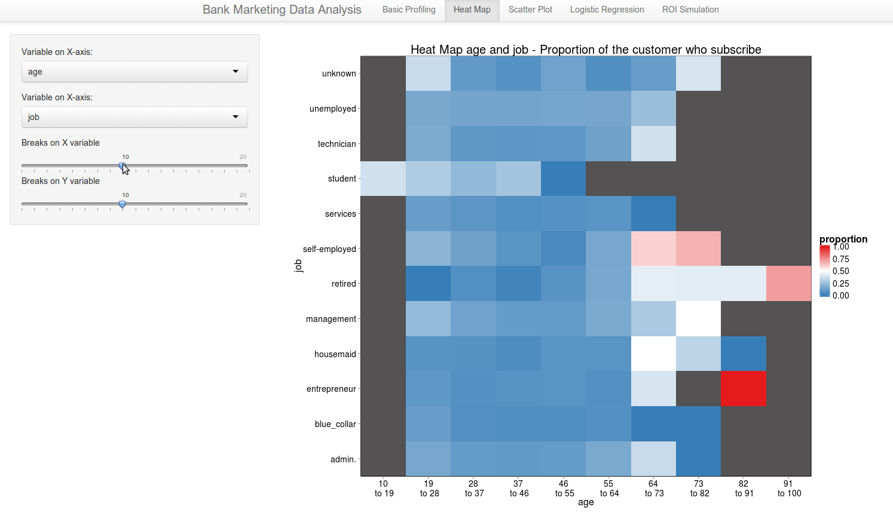


#### Scatter Plot (Multivariate Plots) ####
As another multivariate plot, you can look at a scatter plot. In this scatter plot, you can see the detail as well as the overall. Also, this plot is dense. So you can select the randam sampling portion of all the data points for constructing the plot. In addition, you can select dot size and alpha.

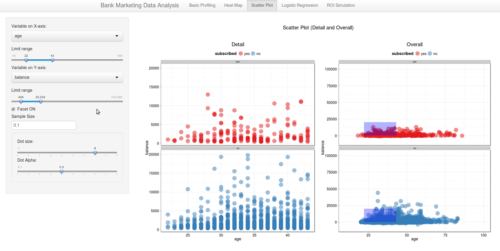


#### Modeling ####
In this part, most of interactivity is associated with modeling. For example, you can select which independent variables are included in the modeling. In terms of data visualization, you can select either coefficients or p value for sort key and choose sort order.

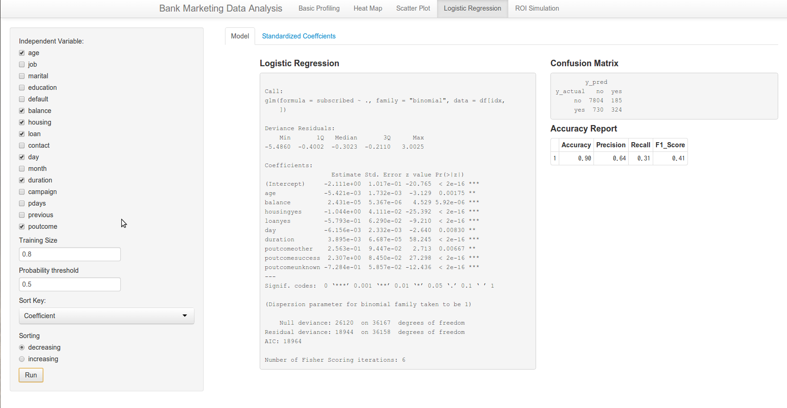
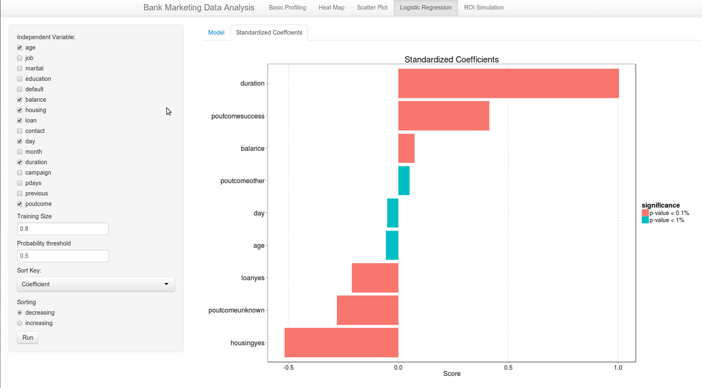

#### ROI Simulation ####
ROI simulation page only have the numeric input to simulate ROI. For example, you can input the assumed cost per person to execute a marketing campagin.
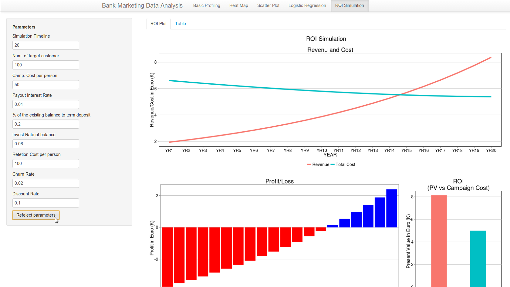


### Prototype Feedback ###
- The prototype was almost same as the final deliverable other than the following changes. I got very helpful feedback, and I reflected them to my work.

| **Component** | **Before**  | **Feedback**  | **changes**  |
|:-------------------|:---------------|:----------------|:--------------------|
| Heat Map |Background color in heat map was black |  "Black color is too dominant" | I changed the color from black to **dark gray** |
| Modeling | Standardized coefficients bar chart could be sorted by coeffcient |"The bar plot could be sorted by p-value as well as by the coefficients" | I addded p value as annother sort key|
| ROI Simulation |In "profit/loss bar chart", the bar's color was always blue | "It is cool if you can distinguish profit and loss by different colors" | I used red for loss and blue for profit |

- All the feedback above were helpful because I thought that they improved graphs' visibility and the application's usability, and therefore I reflected them to my application. Especially, I did not expect that the background color of the heat map was important for audience. However, the group members pointed out that black color distructed the audiences' focus. This feedback was beyond my imagination.

- I got a feedback that I would plot the data points on a scatter plot and overlay a fitted model to the scatter plot. Actually, I already implemented this plot (you can see `get_DecisionBoundary` function in `get_plots.R`), the plot was too dense. As I discussed in scatter plot section, the data has more than 40,000 data points, and even a simple scatter plot easily gets to have data density problem. So, I gave up it, although I appreciated this feedback. 

### Challenges ###
- The most time-consuming part was **choosing colors in heat map**. In terms of overall visualizations in this app, I used red for "Yes" and blue for "No". However, I needed to decide the middle color because heat map needed gradation. I tried many times until the middle color looks reasonable. 

- The simpler UI needed much programming efforts, especially in the first page called "Basic Profiling". This page looks simple, but the inputs are changed based on the type of the selected variable. Also, the chart itself is switched between bar chart and density plot with box plots.

- 
