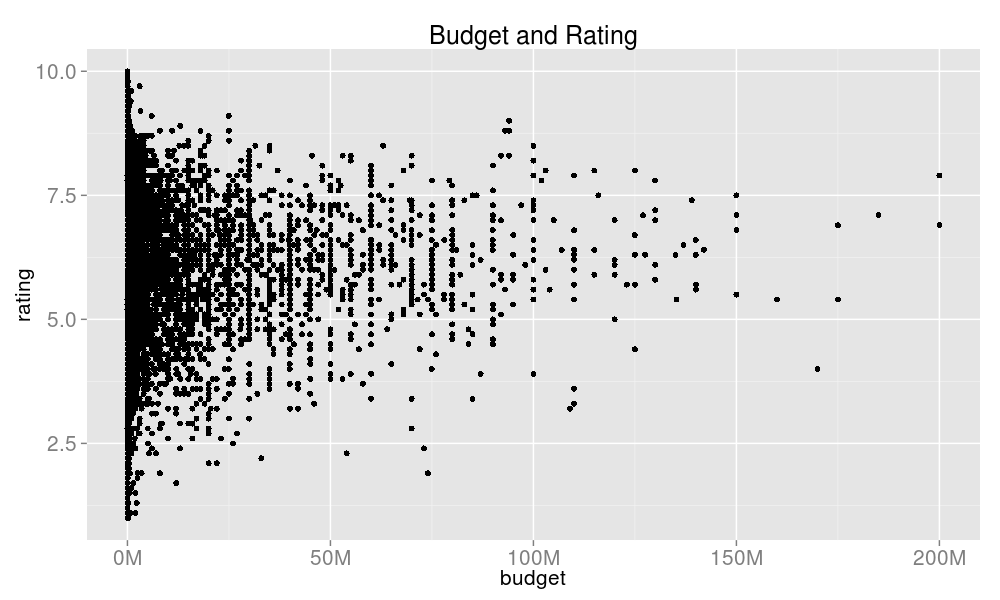
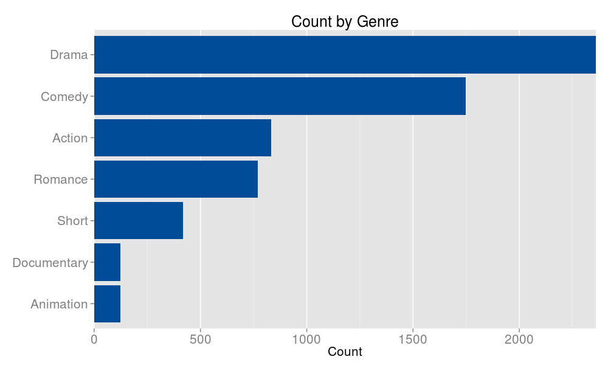
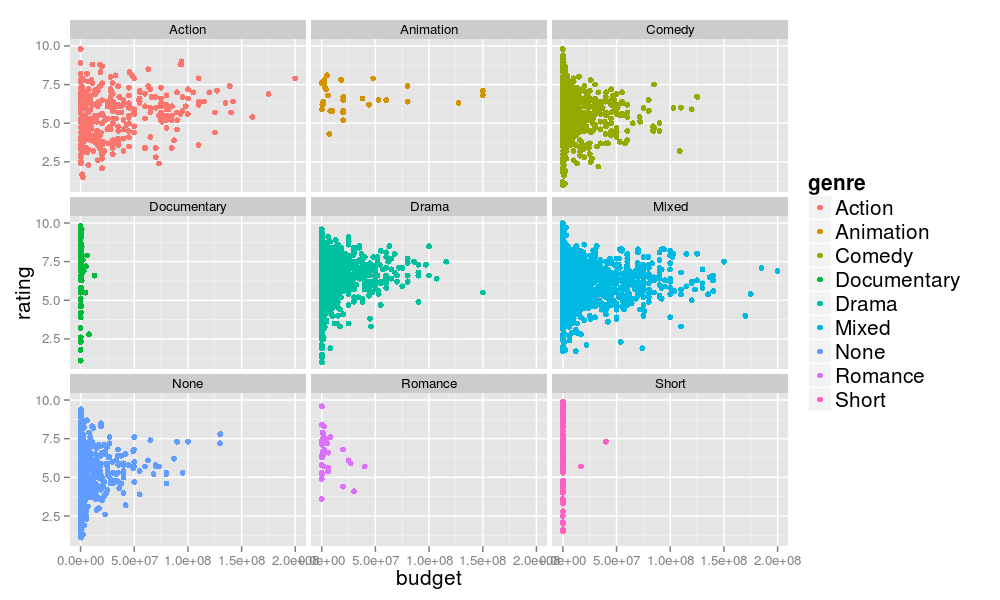

Homework 1: Basic Charts
==============================

| **Name**  | Yosuke Katada  |
|----------:|:-------------|
| **Email** | ykatada@dons.usfca.edu |

## Instructions ##

Prior to running my code, please install the following packages.
- `ggplot2`
- `reshape2`
- `devtools`

Also, To keep PNG files, please specify your working directory before running the code because by using `setwd()`. 

In summary, the following is the R code to run my code.

```
library(devtools)
setwd("/your_working_directory") 
source_url("https://raw.githubusercontent.com/yosukekatada/msan622/9df534c38d8d635dc12849195763b8ccb9aa886b/homework1/MSAN622_HW1.R")
```


## Discussion 1: Movies Data##

Although I expected that "budget"" is somewhat positively correlated to "rating", it is not true. Even if the budget is almost zero, many movies have higher ratings. Also, I notice that the range of rating converges as the budget increases. 




According to the bar chart below, the distribution of the genre count is not uniform. Therefore, I can guess that each genre has different partter on scatter plot of "budget vs rating".



When I look at the scatter plot abou "budgte vs rating" like the first plot, there looks major two patters. First patter is that the range of rating converges as the budget increases. Action, Comedy, Drama, Mixed, and None fall in this pattern. The second pattern is that budget is almost zero and rating has large variation. Documentary and Short are in this pattern. Animation and Romance are fitted in those two patterns. Regarding Animation, budget is unrelated to rating. When it comes to Romance, I cannot see the explicit pattern. 




## Discussion 2: Stock Data##


