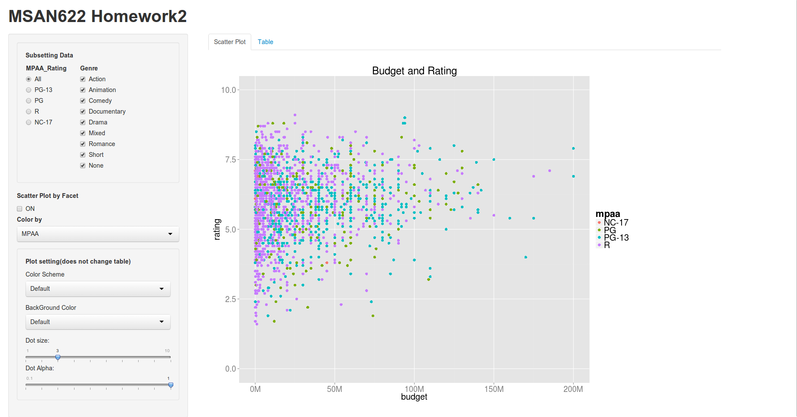
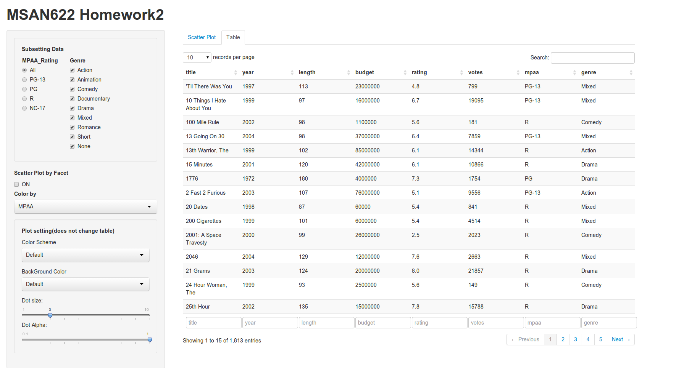

Homework 2: Interactivity
==============================

| **Name**  | Yosuke Katada  |
|----------:|:-------------|
| **Email** | ykatada@dons.usfca.edu |

## Instructions ##

The following packages must be installed prior to running this code:

- `ggplot2`
- `shiny`
- `RColorBrewer`

To run this code, please enter the following commands in R:

```
library(shiny)
shiny::runGitHub('msan622', 'yosukekatada', subdir='homework2')
```

This will start the `shiny` app. See below for details on how to interact with the visualization.
Also, if the `shiny` app is grether than your screen, please adjust zoom ratio on your browser.

## Discussion ##

My shinyapp has two tabs such as "Scatter Plot" tab and "Table" tab. In the "Scatter plot" tab, you can change the deta points by group of MAPP rating as well as genre. Also, you can select the element out of either MPAA rating or genre for coloring the data points. Furtheremore, a click button called "Scatter Plot by Facet" is to expand a single scatter plot to the multiple scatter plot. This function would help you to compare the distributions by genre or MAPP rating. In addition to the functions that I explained so far, I added a plot setting panel for changing the apperance. You can change not only the color scheme but also the background panel's color. If the data points are less recognizable, you can change background color. Also, you can change dot size and dot alpha.




When you want to see the details such as title, length and so on, you can see the raw data behind the scatter plot at the "table" tab.




### Customization ###
In addtion to the requirement, I customized the following functions.

- Table tab: you can see the raw data behind the scatter plot.
- "Scatter Plot by Facet" button: you can see the multiple scatter plot.
- "Color by" list: you can specify either MPAA rating or genre as the element for coloring data points.
- "Background Color" list: you can change the background color on the plot.
