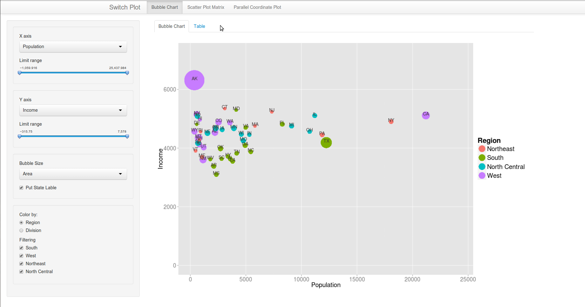
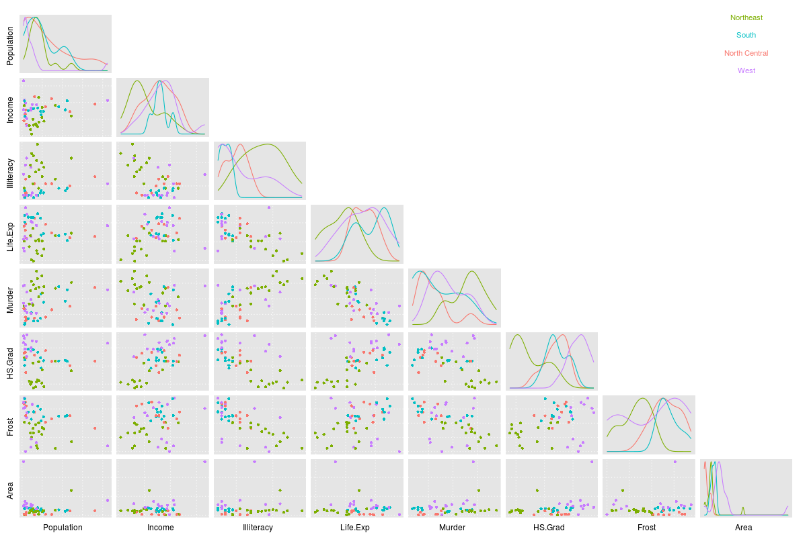
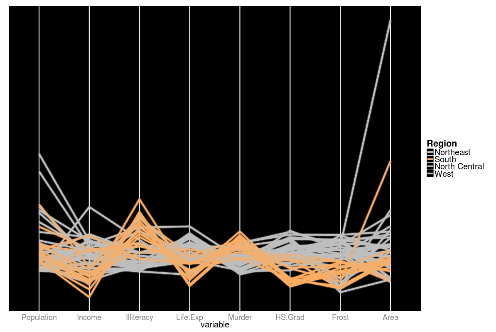
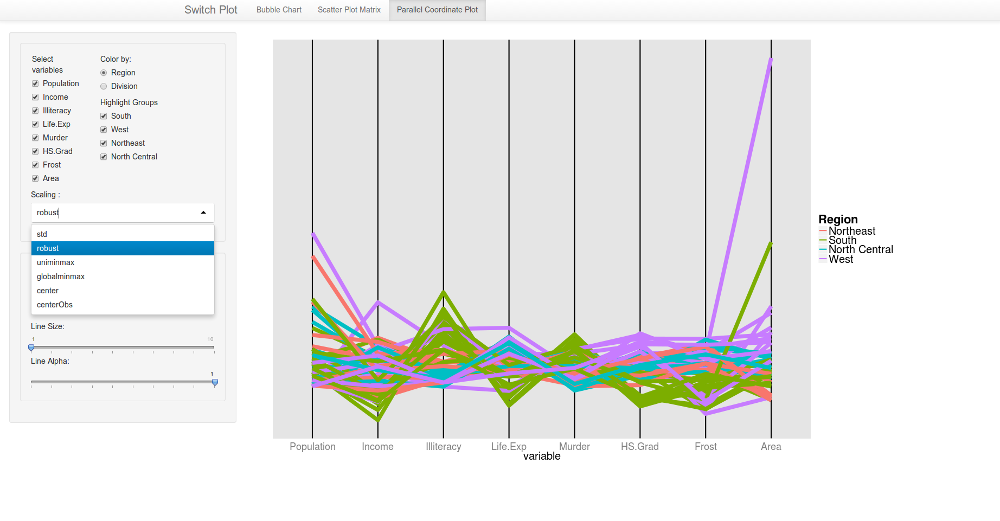

Homework3: Multivariate
==============================

| **Name**  | Yosuke Katada  |
|----------:|:-------------|
| **Email** | ykatada@dons.usfca.edu |

## Instructions ##

Before you start shiny app, please make sure that you install `GGally` and `grid` packages. 
After that, use the following code to run this `shiny` app:

```
library(shiny)
runGitHub("msan622", "yosukekatada", subdir = "homework3")
```

## Discussion ##

### Technique 1: Bubble Plot ###

The objective of the plot is explaining the relationship of the four variables: highschool graduate rate, income, population and region. The assumption is that if the state has higher rate of high school graduate, the income should be higher. In addition, I want to know any geographical and demographic features on it. For this objective, I used a bubble plot, instead heatmap. This is because a bubble plot can show us correlational relationship more easily. 

In terms of layout of the plot, HS.grad should come to X-axis because I suppose that HS.grad is the cause of the high income. So, Income is Y-axis. Also, another numeric feature, population, is expressed by the size of a bubble. Finally, I use Region for coloring because it is categorical.  




#### Customization ####
- Put the labels on the bubbles
- Reordered dataset in order to prevent the large bubbles from overlapping small bubbles


### Technique 2: Scatterplot Matrix ###
In this section, my objective is to explore relationship among numeric variables without clear assumption. For this objective, scatter plot matrix is more appopriate than small multiples. So, I put all the numeric variables on the axes and color data points by region. Although there is another categorical feature like "Division", "Division" has too many levels. In order to avoid too much information on the plot, I do not use "Division".



#### Customization ####
- Created legend
- Deleted X and Y axis lines in histogram on diagonal for simplicity
- Deleted minor lines on each scatter plot because the audience does not care the detail of the number
- Changed the line style of the major lines on each scatter plot to dotted line for making the plot less dense

### Technique 3: Parallel Coordinates Plot ###

I have not used Paralell Coordinates Plot, but it is very useful for exploring the data distribution and relationship as long as the data is not too many. I think that boxplot can be used for the almost same purpose, but boxplot cannot show us the relationship between the variables. 

According to the two plots above, I start to understand that the states in south region have some characteristics. So, to make sure them, I created the following plot to make contrast between south states and others. 



#### Customization ####
- Used black color for background to make good contrast
- Deleted everything on Y-axis because those will not give any information
- Reordeed the data to get the highlited data to be on the first layer.

### Interactivity###

In shiny app, you can select a plot among the three plots from the navigation bar. 
In "Bubble chart" tab, you can choose which column is used for X-axis, Y-axis, the size of bubble and coloring. Also, you can use *Zooming* and *Filtering* for diving into the detail or smaller differences. In addition, you can check the data behind the plot by clicking table tab. The table is connected to the plot, so if you filter the data on the plot tab, the table is also subsetted. Due to this interacticity, you can quickly check your assumptions on the data and get insight. 


Next tab, "Scatter Plot Matrix" gives you the interactive scatter plot matrix. In this plot, you can select which variables should be included. Also, you can use *Filtering* based on region. This help you discover some relationship or clusters.


The last plot is Parallel Coordinates Plot. Like the other two plots, you can choose the variables to be included in the plot. Also, if you select the subsets of the data based on Rigion or Division, the selected data is highlighted (*Brushing*). In parallel coordinates plot, the context is very important. Thefore, I use highlight technique not filtering technique. Correspondingly, you can change the color of the background, the line size, and alpha to get clearer highlighted graph.


