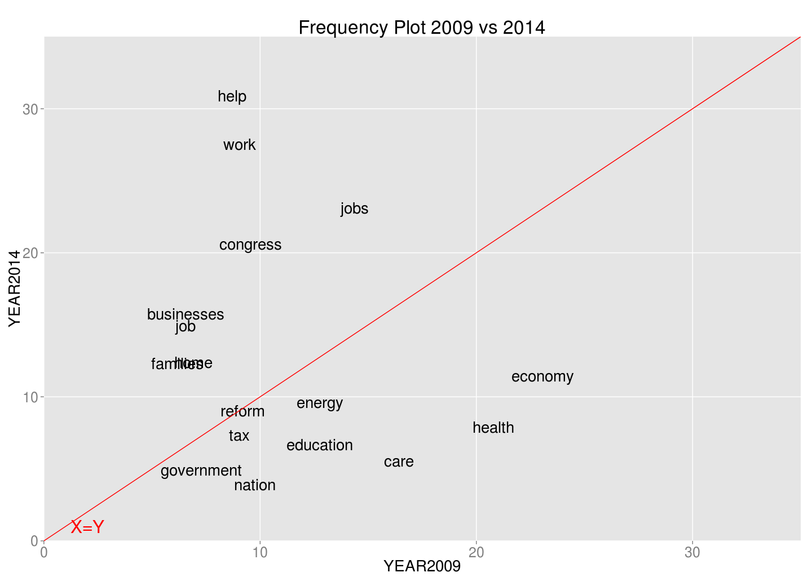
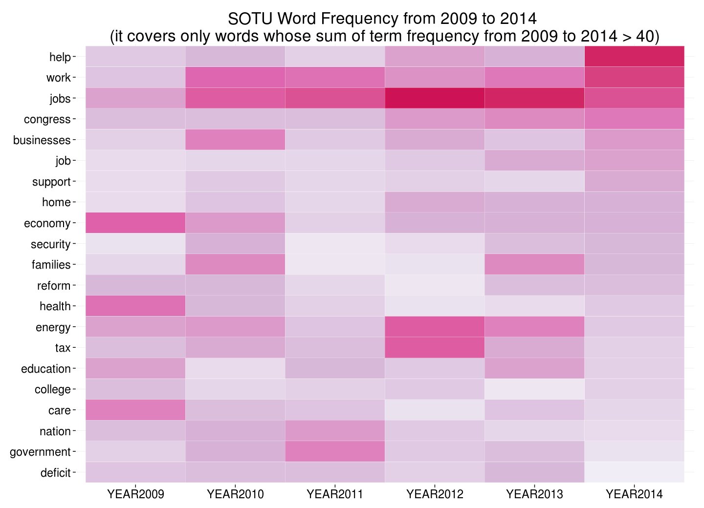
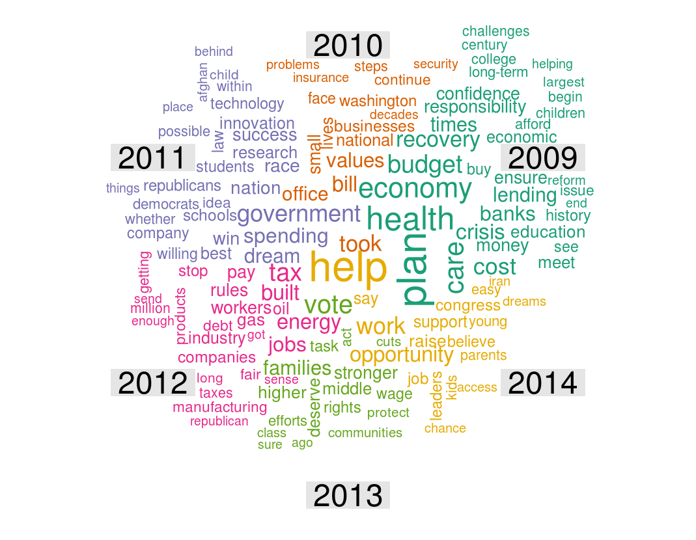

Homework4: Text Visualization
==============================

| **Name**  | Yosuke Katada  |
|----------:|:-------------|
| **Email** | ykatada@dons.usfca.edu |

## Instructions ##

Please make sure that there is a folder whose name is "dataset" in your working directory because my code automatically create "dataset" folder in your working directory and download the datafiles into "dataset" directory. Also, please make sure that you install `tm`,`SnowballC`, `wordcloud`,`ggplot2`,`reshape2`, and `downloader`packages. 

```
library(devtools)
source_url("https://raw.githubusercontent.com/yosukekatada/msan622/master/homework4/HW4.R")
```

## Discussion ##

### Dataset ###
Text data that I used is SOTU addresses from 2009 to 2014.Please see the folder called `dataset` in github repository.

| **File Name**  | **Word Count**  |
|----------:|:-------------|
|  Barack_Obama_2009.txt | 6053 |
|  Barack_Obama_2010.txt | 7221 |
|  Barack_Obama_2011.txt | 6874 |
|  Barack_Obama_2012.txt | 7026 |
|  Barack_Obama_2013.txt | 6783 |
|  Barack_Obama_2014.txt | 6987 |
|  **Total** | **40944** |


### text processing pipeline ###
The following is the pipeline.
- Made all characters lower case
- Removed stop words
- Deleted punctuation and white spaces
- Excluded the words other than noun by tagging with Python nltk package
- Removed some meaningless words by looking at the remaining words

### 1: Frequency Plot (ggplot) ###
First plot is a frequency plot to see how the topics are different between 2009 and 2014. For creating the plot, I used the words whose term frequency is greater than 50. According to this plot, "economy","health","care" are most frequeny words in 2009, but those are less frequent in 2014. On the other hand, "help","work","jobs", and "congress" are used many times in 2014, althogh they are less in 2009.



####Customization####
- Draw the red line (X=Y) to clarify which words increase and decrease
- Deleted minor line and made the font size bigger for data ink ratio
- Made the plot area bigger for data density


### 2: Heatmap (ggplot) ###

When we compare the words between only two years, frequency plot is useful. However, it would be too busy for comarison among more than two years. In order to compare more than two years, I use heatmap like the following. The words on Y-axis is sorted  by decreasing order of the term frequency in 2014. According to the heatmap, you can know that which words are most frequent in each year and you can guess how emphasized topics has been changed. 




####Customization####
- Ordered by term frequeny
- Fliped x and y axis
- Changed color scheme


### 3: Comparison Cloud (wordcloud) ###

So far, I used frequency plot and heatmap for comparision of text data. For the same objective, I employed word cloud for comparison, the word clound called "Comparison Cloud". In comparison cloud, the more frequent words are, the bigger they are. Also, the words are colored by year. Although the clound is less orginized and requires more time to understand, it would be informative. 



####Customization####
- Made plot area large and set max words to fit the cloud into the plot area
