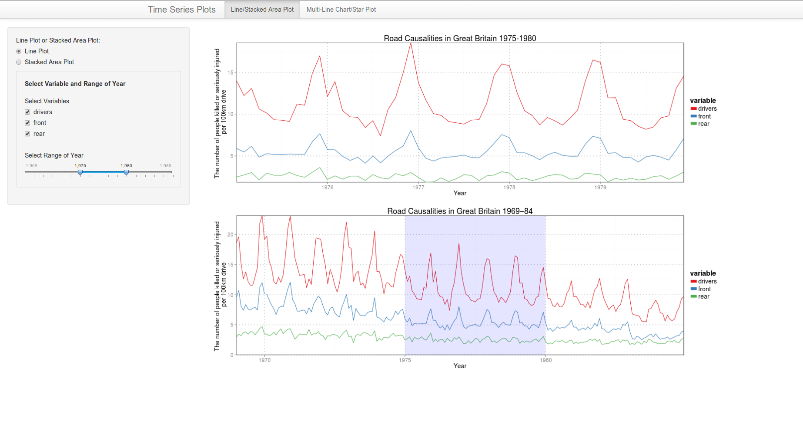
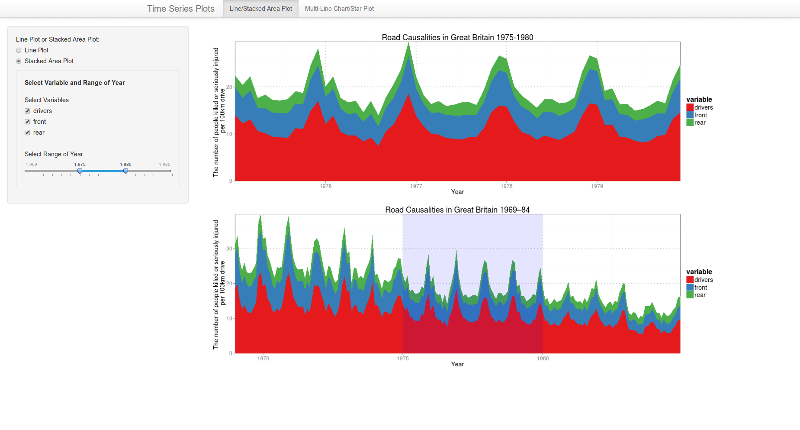
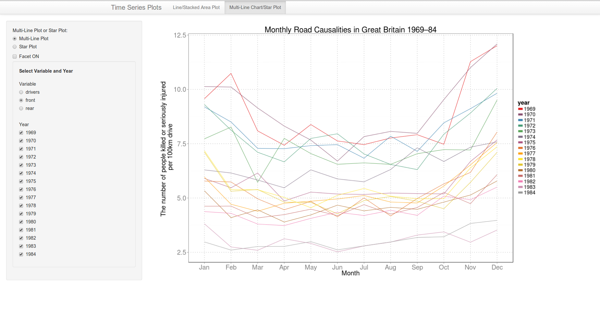
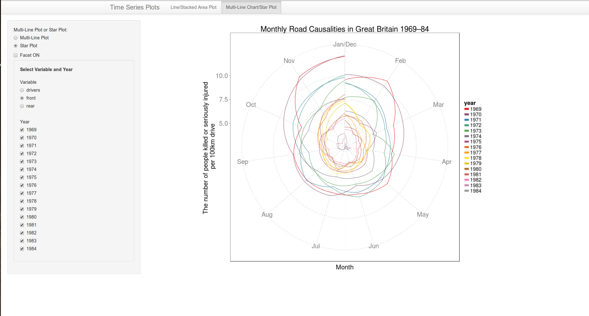

Homework 5: Time Series Visualization
==============================

| **Name**  | Yosuke Katada  |
|----------:|:-------------|
| **Email** | ykatada@dons.usfca.edu |

## Instructions ##

Before you start shiny app, please make sure that you install `reshapes` packages. 
After that, use the following code to run this `shiny` app:

```
library(shiny)
runGitHub("msan622", "yosukekatada", subdir = "homework5")
```

## Discussion ##
I selected **interactivity** option, and developed the following data visualizations.

### Data ###
In `Seatbelts` data, I am interested in how many people are killed and seriously injured. However, it is natural that the number of the people killed or injured increases as the drive distance goes up. So, I transformed the original number of the people killed or seriously injured into the number per 100km drive distance for fair comparision.

##Line Plot/Stacked Area Plot##

### Technique 1: Line Plot ###

I want to know trend and seasonality on the the people in front seats and rear seats as well as drivers. So, I set *time* at X-axis and*the number of people who killed or seriously injured per 100km drive distance* at y-axis. According to this plot, I can know that the number of drivers is always largest and that there would be a seasonality.



### Technique 2: Stacked Area Plot ###

About the same data I used in technique 1, I look at the aggregated trend by using stacked area plot.



#### Customization####
- Changed the color scheme for clearity
- Made the major and minor grid thinner for higher data ink ratio

#### Interactivity ####
- **Brushing :** You can look at both of the detail and overall by selecting the range of year.
- **Filtering :** You can select which variables are included in the plot.


##Multiline Plot/Star Plot##

As I discussed above, there would be a seasonality on this data. In order to look at the detail, I develop the multipline plot and star plot for seeing the seasonality on monthly basis.

### Technique 3: Multiline Plot ###

For this purpose, I developed a multiline plot. X-axis is month, and Y-axis is the number of the people perished or seriously injured per 100km drive. Color represents year.



### Technique 4: Star Plot ###

As we discussed in the class, line plot has a problem of disconnecting the cycle of the seasonality. So, I used star plot in order to connect December and Janualy.



#### Customization ####
- Changed the color scheme for clearity
- Made the major and minor grid thinner for higher data ink ratio
- Made the large plot area for fair data density

#### Interactivity ####
- **Filtering :** You can select which variable and years are included in the plot.
- You change the plot format between a single multiline plot/star plot and a small multiple plot.
