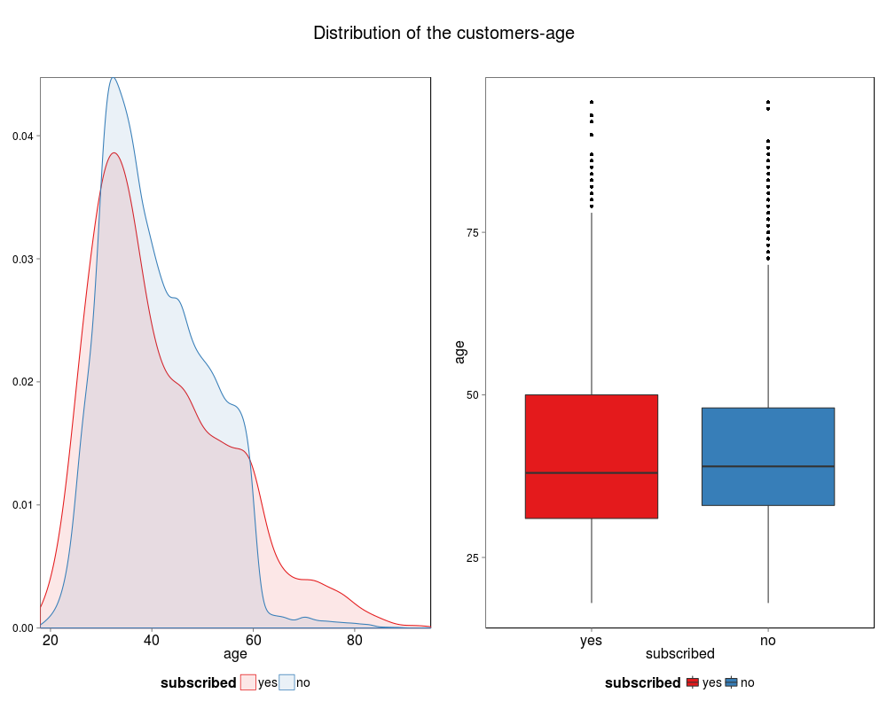
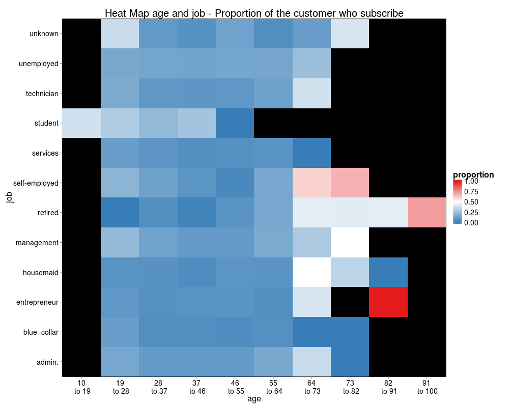
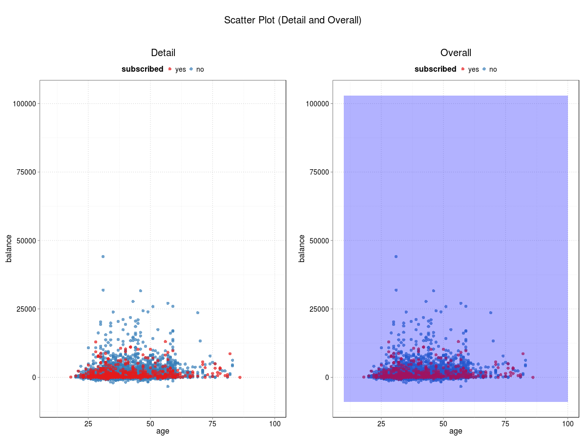
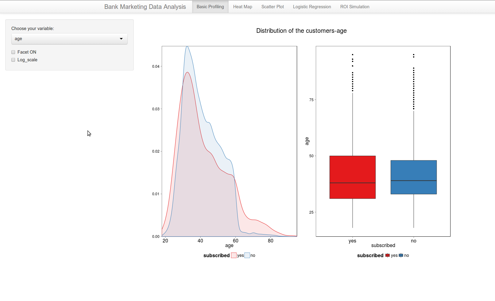
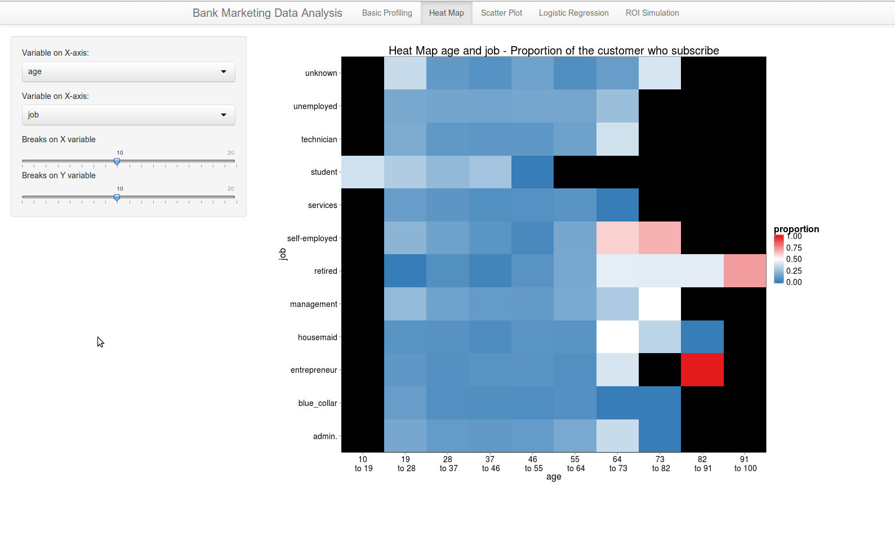
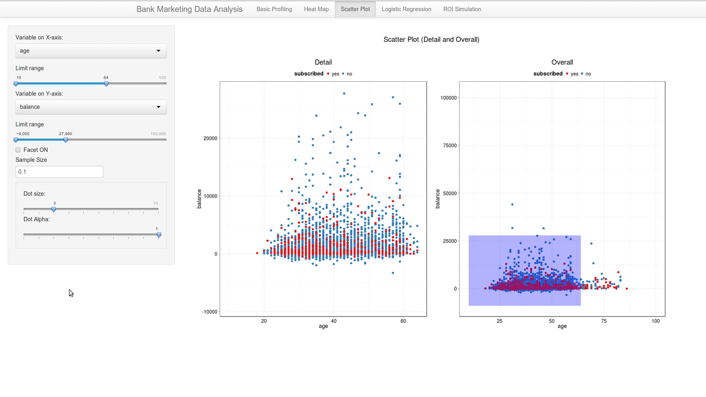
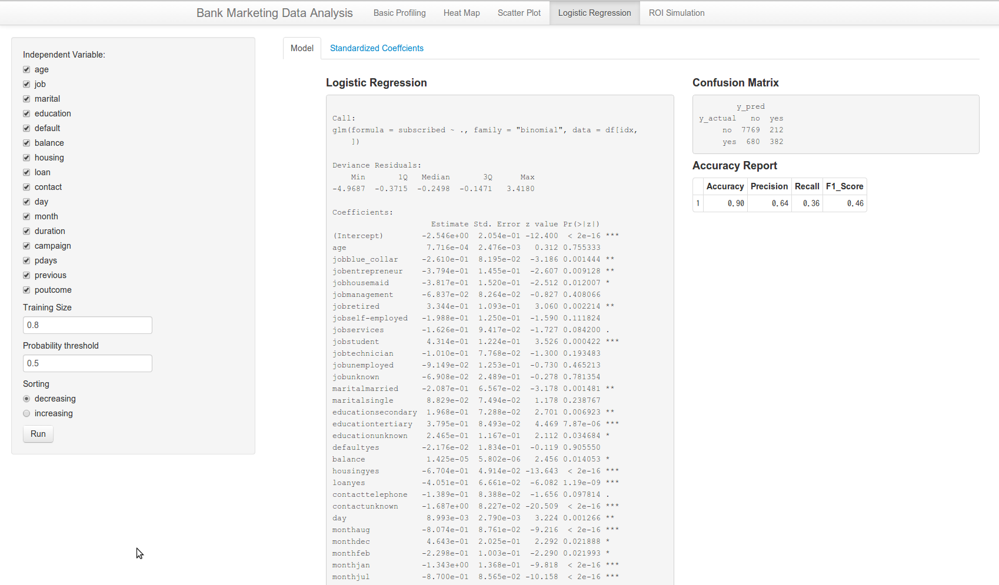
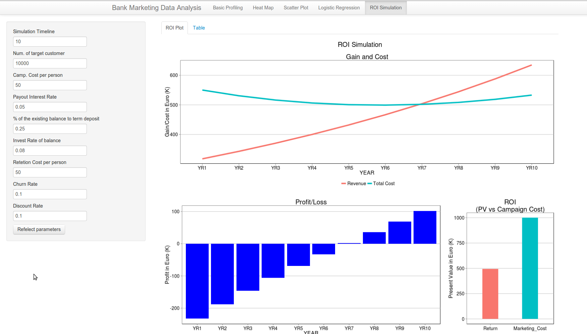

Project: Prototype
==============================

| **Name**  | Yosuke Katada  |
|----------:|:-------------|
| **Email** | ykatada@dons.usfca.edu |


## Instructions ##

Before you start shiny app, please make sure that you install the following packages:
- `ggplot2`
- `reshape2` 
- `reshape` 
- `scales` 
- `grid` 
- `plyr` 
- `RColorBrewer` 

After that, use the following code to run this `shiny` app:

```
library(ggplot2)
library(reshape2)
library(reshape)
library(scales)
library(grid)
library(plyr)
library(RColorBrewer)
library(shiny)
runGitHub("msan622", "yosukekatada", subdir = "project-prototype")
```

## Discussion ##
### Data ###
The dataset used in this application is the result of a marketing campaign to acquire term deposit customers at a bank. The data has 45211 rows and 17 variables. Each row represents each customer. The independent variables are demographica, transaction-based and marketing reactions. A dependent variable is "has the client subscribed a term deposit?", which is binary response. 

### Target User ###
The puporse of analyzing the data is to analyze the difference the responses, and develop the predection model for future marketing activity. More concretely, I suppose that this application is for a marketing analytics person to analyze the data, plan the future campaign and prepare their reporting quickly and smoothly. Also, I suppose that the audience of the analyzed result would be Marketing Director or Project owner. Therefore, I tried to make the plots simple as much as possible and easy to understand without any technical experties.

This application consists of four parts: Univariate plots, Multivariate plots, Modeling, and ROI simulation.

### Plots ###
#### Univariate Plots ####
In univariate plots, I created bar chart and 100% bar chart if the variable selected is factor. In case that the selected variable is numeric, I used density plot and box plot.




#### Mutivariate Plots ####
Also, for mutivariate plots, I used heat map and scatter plot.



#### Modeling ####
In the modeling (Logistic Regression), I visuallized the standard coefficients, which is a kind of importance of the variables by bar chart.


### UI ###
#### Univariate Plots ####
UI is simple, but the application can automatically switch the plots type by distingushing whether selected variable is numeric or not.
 

#### Mutivariate Plots ####
In heat map, you can select the variables on X and Y axis. Also, if you select numeric variable in heat map, the application discretize the numeric variable. Also, you can choose the granuity to discretize numeric values.
 

Only for numeric variables, you can use scatter plot. I used zooming technique because data points are dense. Also, in order to ease the density problem, you can use random sampling and reduce the number of the data points on the plots.
 

#### Modeling ####
You can run Logistic regression model based on the variables you select.
 

#### ROI Simulation #### 
Finally, based on the model you estimated, you can run cash flow simulation and calculate project ROI. Based on the insight from this simulation as well as the model, marketing analyst can propose actionable plans.
 
