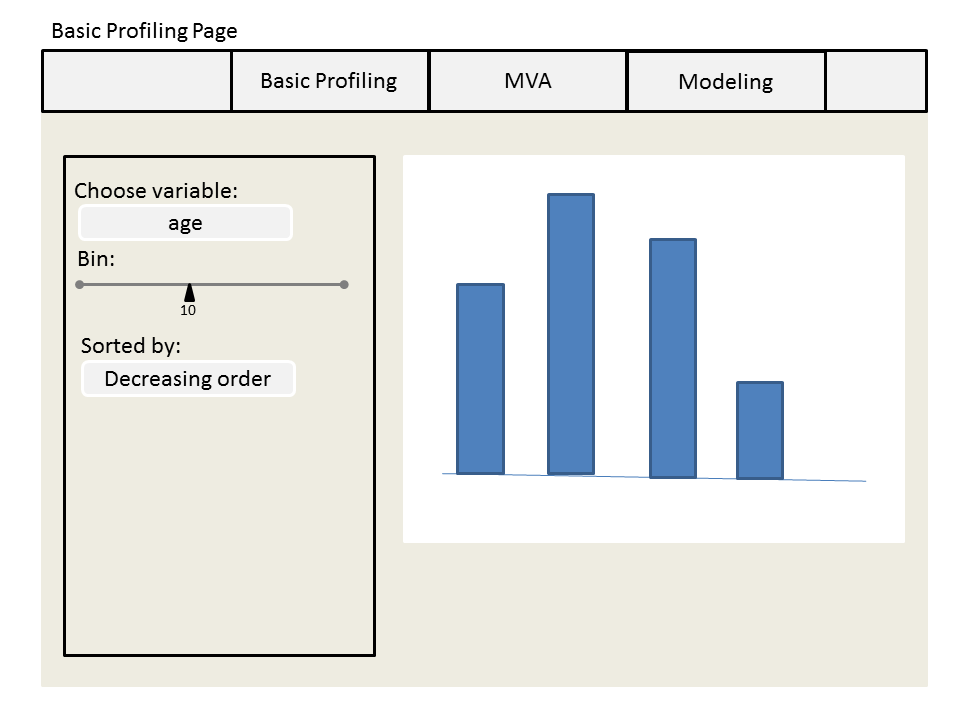

Project: Sketch
==============================

| **Name**  | Yosuke Katada  |
|----------:|:-------------|
| **Email** | ykatada@dons.usfca.edu |

Planned Tools
------------------------------
My visualization for the final project is implementing business intelligence system for marketing analytics person, who is the target audience. The dataset is related to the result of a marketing campaign to get new customers at a bank. The data has 16 predictor variable and 1 target binary variable. So, I will implement a shiny app for understanding basic customer profile, investigating which factor contributes to customer acqusition, and modeling this result for the future campaign. 

So, my tools would be:
- `ggplot2`
- `shiny`
- `stats` (For modeling)
- `randomForest`  (For modeling)

Planned Techniques and Interaction
------------------------------
I would use **bar chart**, **scatter plot**, **paralell coordinates plot** and **heatmap**.

The following is the detail. My visualization consists of three aspects.

#### Basic Profiling ####
- I would employ **bar chart** for showing univariate sumamry of all the variables.
- For interaction, **sorting** woudl be used.

#### Visualization for multivariate variables####
- I would implement **scatter plot**(or **heatmap** if data is too dense) and **paralell cooridates plot** for investigating the relatinship among numeric variables. Also, I would use **heatmap** for visualizing categorical values.
- **zooming** and ** filtering** would be used for scatter plot and paralell coordinates plot. Also, **sorting** woudl be used for heatmap.

#### Modeling ####
-After the two steps above, I suppose that the marketing analytics person would like modeling. For modeling, I would implement an interactive modeling tool with visualization. The model candidates are Logistic regression and Random forest. So, I would use **bar chart** for the importance of the predictor variables. Also, I would use **scatter plot** for showing decision boundary.
- **zooming** and ** filtering** would be used for scatter plot.

Planned Interface
------------------------------

#### Basic Profiling ####

#### Visualization for multivariate variables####
[page2-1](page2-1.png)
[page2-2](page2-2.png)

#### Modeling ####
[page3-1](page3-1.png)
[page3-2](page3-2.png)
